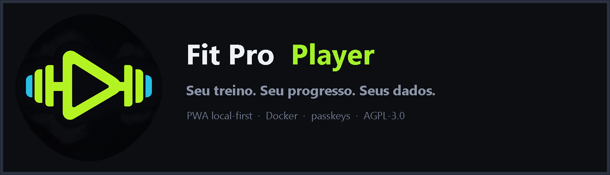

<div align="center">



Planeje treinos, acompanhe cargas, registre o peso corporal e visualize sua evolução.

[Aplicação na Vercel](https://fit-pro-player.vercel.app) · [Código-fonte](https://github.com/fabianoschmits/fit-pro-player)

</div>

## Modos de uso

O Fit Pro Player oferece dois modos, ambos sem telemetria:

- **Vercel / PWA local-first:** começa vazio e salva os dados somente no navegador. Não exige conta ou backend. Exporte backups JSON regularmente, especialmente antes de limpar os dados do navegador.
- **Servidor próprio:** frontend + API Node em Docker, com perfis por passkey, sincronização entre dispositivos, painel administrativo e Web Push. Os dados ficam em `./data`.

O modo público da Vercel é intencionalmente local-first. A API original usa arquivos persistentes e timers de processo; funções efêmeras não são um local seguro para guardar contas e treinos.

## Executar nesta máquina (Windows)

Requisitos: Node.js 22+ e npm.

```powershell
Copy-Item .env.example .env
npm install
npm run setup
npm run dev
```

Abra [http://localhost:8080](http://localhost:8080). A API é iniciada em `127.0.0.1:3000` e o Vite encaminha `/api`. O catálogo oferece somente os 173 exercícios que já possuem sequências SVG validadas e incorporadas ao código, sem links, imagens raster ou modelos externos. Os outros 1.151 registros da base permanecem preservados como pendentes para não quebrar planos e históricos existentes, mas não aparecem em novas seleções até receberem animações correspondentes. A animação pausa fora da tela ou em uma aba oculta e não inicia automaticamente quando o sistema solicita movimento reduzido.

A ordem inicial prioriza os exercícios mais executados por número de séries na análise do [StrengthLog com milhões de treinos de mais de 500 mil usuários](https://www.strengthlog.com/strength-training-statistics/): supino, agachamento, levantamento terra, puxada alta, desenvolvimento e remada aparecem primeiro, seguidos pelos demais movimentos presentes nas listas feminina e masculina.

Comandos úteis:

```powershell
npm test
npm run build
npm run build:vercel
npm run audit
```

## Executar com Docker

Inicie o Docker Desktop e rode:

```powershell
Copy-Item .env.example .env
docker compose up -d --build
```

Abra [http://localhost:8080](http://localhost:8080). Para usar passkeys em outro dispositivo, publique o serviço em um domínio HTTPS e ajuste `RP_ID` e `ORIGIN` no `.env`; consulte [docs/SELF_HOSTING.md](docs/SELF_HOSTING.md).

Dados persistentes ficam em `./data`. Faça backup dessa pasta e nunca a envie ao Git.

## Implantar na Vercel

O arquivo `vercel.json` já configura build, pasta de saída e cabeçalhos de segurança. Pela CLI:

```powershell
vercel
vercel --prod
```

O build usa `frontend/.env.vercel`, ativa o modo local-first e incorpora os sprites SVG e mapas musculares no próprio app. Nenhum segredo é necessário.

## Estrutura

- `frontend/`: React 19, Vite, Zustand, PWA e projetos Capacitor.
- `api/`: API Node para o modo self-hosted, passkeys e armazenamento JSON.
- `web/`: nginx para servir o frontend e encaminhar `/api` no Docker.
- `mcp/`: servidor MCP opcional e somente leitura para dados self-hosted.
- `docs/`: implantação própria e builds móveis.

## Segurança e privacidade

- Sem analytics ou telemetria.
- Cookies de sessão `HttpOnly`, `SameSite=Strict` e `Secure` em HTTPS.
- Limite de requisições nos endpoints de autenticação.
- CSP, proteção contra framing, política de permissões e `nosniff` na Vercel e no nginx.
- `.env`, dados de usuários, certificados e chaves de assinatura são ignorados pelo Git.

Veja [SECURITY.md](SECURITY.md) para comunicar vulnerabilidades.

## Licença e dados de terceiros

O código é distribuído sob **GNU AGPL-3.0-or-later**. Uma implantação pública modificada deve oferecer aos usuários o código-fonte correspondente desta versão. Consulte [LICENSE](LICENSE) e [NOTICE.md](NOTICE.md).

Metadados, diagramas e bibliotecas de terceiros têm avisos próprios. As animações SVG locais vêm do Workout Guide e permanecem sob CC BY-SA 4.0; consulte [THIRD_PARTY_ASSETS.md](THIRD_PARTY_ASSETS.md) e [NOTICE.md](NOTICE.md).
